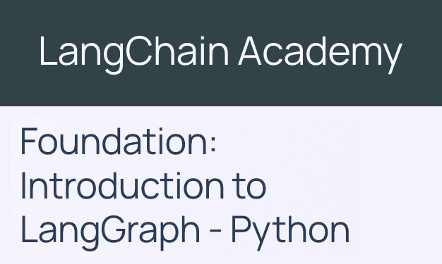

# Foundation: Introduction to LangChain

> "What makes an application agentic is its ability to take actions autonomously, like reading an email, searching the Internet or writing a block of code, perceive the output of those actions and react accordingly."

Based on [Foundation: Introduction to LangChain - Python](https://academy.langchain.com/courses/take/foundation-introduction-to-langchain-python/)



**Converted to TypeScript...**

## Installation


  ```bash
  npm install dotenv langchain

  npm install @langchain/openai
  npm install @langchain/anthropic
  npm install @langchain/google-genai
  ```

## Module 1: Create Agent

  > "Within 30 minutes you'll be building a personal Chef that suggests recipes based on pictures of your fridge."

  - [x] [1.1 Foundational models](./Module-1/1.1_foundational_models.js)
  - [x] [1.1 Prompting](./Module-1/1.1_prompting.js)
  - [x] [1.2 Tools](./Module-1/1.2_tools.js)
  - [x] [1.2 Web Search](./Module-1/1.2_web_search.js)
  - [x] [1.3 Short-Term Memory](./Module-1/1.3_memory.js)
  - [x] [1.4 Multi-modal Messages](./Module-1/1.4_multimodal_messages.js)
  - [x] [1.5 Project: Personal Chef](./Module-1/1.5_personal_chef.js)

## Module 2: Advanced Agent

  > "MCP, customized memory, multi-agent systems. Build an entire team of synchronized wedding planners using up-to-date fly prices and venue details."

  - [ ] Model Context Protocol (MCP)
  - [x] [Context](./Module-2/2.2_runtime_context.js)
  - [x] [State](./Module-2/2.2_state.js)
  - [x] [Multi-Agent Systems](./Module-2/2.3_multi_agent.js)
  - [x] Project: Wedding Planner
  - [x] Bonus: RAG
  - [x] Bonus: SQL

## Module 3: Production-Ready Agent

  - [ ] What is Middleware?
  - [x] Managing Long Conversations
  - [x] Human In The Loop (HITL)
  - [ ] Dynamic Agents
  - [ ] Project: Email Assistant
  - [ ] Bonus: Agent Chat UI