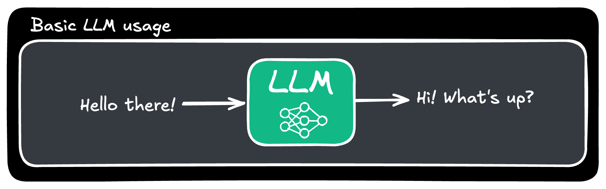
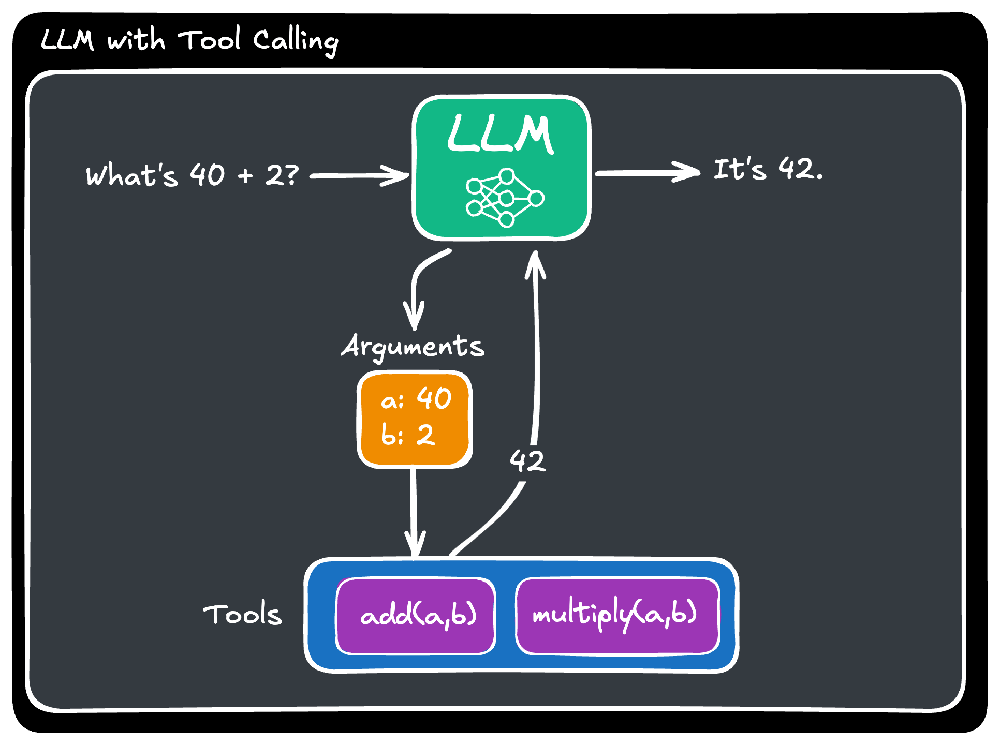

# TOOL CALLING

## PREREQUISITES

  - [Node.js](https://nodejs.org/en/download/)

  - [Ollama](https://ollama.com/)

  If you intend to use a local LLM through Ollama, you will need to install [Ollama](https://ollama.com/) and the [llama3 LLM model](https://ollama.com/library/llama3) via Ollama. 

  To ensure that you have successfully downloaded and installed all of the above, run the following commands through your terminal:

  - Check whether Ollama is installed: `ollama --version`
  - Check whether the required models are available: `ollama list`

## CONCEPTS

  Most `Large Language Models` cannot take actions on their own. They can receive text or other media as input (e.g. images, PDFs, audio, etc.) and respond, usually, in the form of natural language (either text or speech).

  

  `Tool calling` provides a way to allow LLMs to decide whether they need to execute a particular function, prepare the arguments that need to be passed to that function and finally execute it to receive some output that can be used as additional information to the final text response from the LLM.

  This allows LLMs to not only interact with humans, through natural language, but also interact directly with software systems such as databases, APIs and other.     

  

  By giving LLMs the ability to take action (by selecting one of the available tools and using it) we are entering the world of `Agents`, _"systems that take a high-level task and use a Large Language Model as a reasoning engine to decide what actions to take and execute those actions"_.

  This guide is going to help you get started with the `Tool Calling` capabilities that are provided by `LangChain.js`.

## STEPS

  This guide is based on `version 0.3` of LangChain.js.

  - Clone the repo and install all required dependencies:
    - `git clone git@github.com:in-tech-gration/LangChain.js.git`
    - `cd LangChain.js/tool-calling`
    - `npm install` or `npm i`

  - **Step 1:**
    - Dependencies: 
      - `npm install zod @langchain/core @langchain/ollama`
    - Code: [basics-01.js](./step-by-step/basics-01.js)
  - **Step 2:**
    - Code: [basics-02.js](./step-by-step/basics-02.js)
  - **Step 3:**
    - Code: [basics-03.js](./step-by-step/basics-03.js)
  - **Step 4:**
    - Code: [basics-04.js](./step-by-step/basics-04.js)

  - **Extras (5): Querying a Database:**
    - Dependencies: 
      - `npm install sqlite3`
    - Code: [extras-05.js](./step-by-step/extras-05.js)

## REFERENCES & RESOURCES

  - [LangChain Concepts: Agents](https://js.langchain.com/docs/concepts/agents)
  - [LangChain Concepts: Messages](https://js.langchain.com/docs/concepts/messages/)
  - [LangChain Concepts: Tool Calling](https://js.langchain.com/docs/concepts/tool_calling)
  - [LangChain: Ollama Chat Model](https://js.langchain.com/docs/integrations/chat/ollama)
  - [LangChain: Tool Calling Best Practices](https://js.langchain.com/docs/concepts/tool_calling#best-practices)
  - [AI Agents in production](https://www.langchain.com/breakoutagents)

## CHANGELOG

- [x] Create a basic step-by-step Tool Calling process
- [ ] Create an agent that does arithmetic operations and checks for Cryptocurrency prices
- [ ] Create an agent that can make calls to a SQLite Music database
